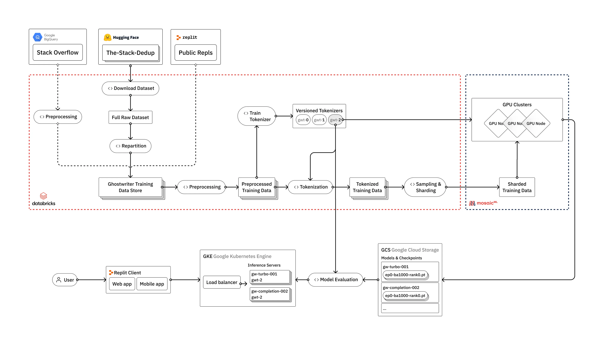

# How to train your big language model

# Reference information

* [How to train your own Large Language Models](https://blog.replit.com/llm-training)

# content

* Data input
* Stack Overflow | The-Stack- Drugs (Hugging Face) | Public REP IT
* Data processing
* Data Bricks
* Tokenize and Vocabular Training
* Training our own custom vocabulary meters so that our model can better understand and generate code content
* Model training
* Mosaic ml
* Evaluate
* Humaneval framework
        
Remark:
* DataBricks is a cloud computing company, which provides a unified data analysis platform to help enterprises process and analyze large -scale data more efficiently.
* Hugging Face is a leading artificial intelligence company that focuses on natural language processing (NLP) and machine learning.
* Mosaicml is a company focusing on improving the training efficiency of machine learning models and reducing training costs.It provides a platform for training and accelerating the training process of optimizing and accelerating large -scale machine learning models.

