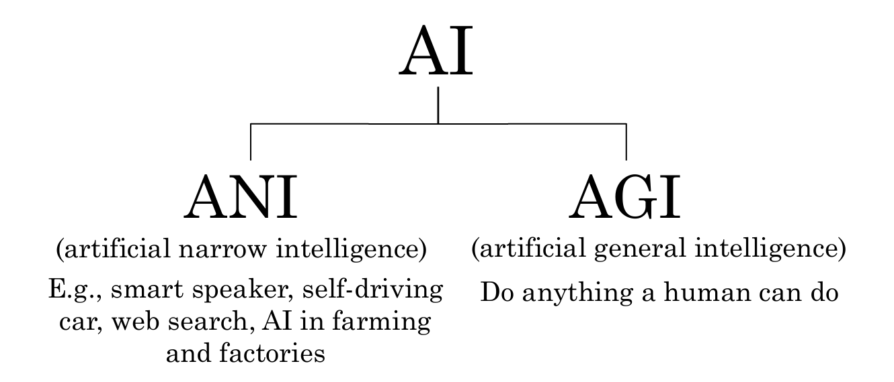
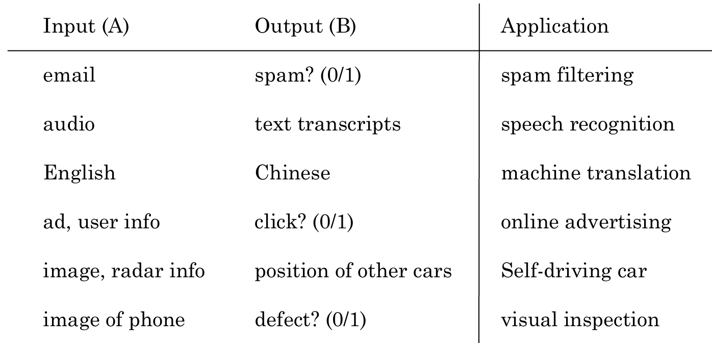

# 什么是AI

* ANI(artificial narrow intelligence) 弱人工智能
* AGI(artificial general intelligence) 强人工智能

## 机器学习

机器学习主要包含以下几个类别：

* 监督学习（Supervised Learning）
     * 使用已知输入和输出来训练模型、以便对新的未知数据进行预测。
     * 常见的任务类型包括分类（Classification）和回归（Regression）。
* 非监督学习（Unsupervised Learning）
    * 使用无标签的数据，目的是找出数据内部的结构或模式。
    * 典型任务包括聚类（Clustering）、降维（Dimensionality Reduction）、异常检测（Anomaly Detection）等。
* 强化学习（Reinforcement Learning）
    * 让一个代理通过与环境的交互来学习决策规则。代理会根据环境反馈的奖励或惩罚来调整其行为，以便在未来获得最大的累积奖励。
    * 应用场景包括游戏、机器人控制、资源调度等领域。
* 半监督学习（Semi-supervised Learning）：
    * 半监督学习介于监督学习和非监督学习之间。它利用少量的带标签数据和大量的无标签数据来进行学习，以提高模型的性能。
    * 这种方法在**标签难以获得或成本高昂的情况下非常有用。**
* 自监督学习（Self-supervised Learning）：
    * 自监督学习是一种特定类型的无监督学习，它通过构造伪标签（pseudo-labels）来指导模型学习。这种方法通常用于预训练阶段，在不需要人工标注的情况下让模型学习到有用的表征。
    * 该技术常用于**视觉、语音和自然语言处理任务**。

### 监督学习

监督学习的demo:

## 什么是数据

获取数据

* 手工标签
* 观察用户行为
* 从网站/合作伙伴下载

脏数据的危害：

* garbage in, garbage out   数据的重要性
* 数据问题
    * 错误标签
    * 缺失值
* 多种类型的数据
    * 图像、音频、文本（归一化处理）

## AI术语

* 机器学习： 一门研究领域，赋予计算机无需明确编程就能学习的能力。
    * 主要类型：监督学习、非监督学习、强化学习、半监督学习、深度学习
* 数据科学： 从大量数据中提取有价值的信息。
    * 关键技能：数据清洗和预处理、统计分析、数据可视化、数据挖掘、数据库管理、编程能力（如Python、R）、业务理解能力

## 什么创建了AI公司

**人工智能转型手册（AI Transformation）**

1. 执行试点项目以获得动力。
2. 建立一个内部AI团队。
3. 提供广泛的人工智能培训。
4. 制定人工智能战略。
5. 发展内部和外部的沟通
    * IT团队   AI团队
    * 交互，确定AI团队需要的data，具体内容，标签等

深度学习 神经网络

## 机器学习可以做什么和不可以做什么

**明白AI能做和不能做的事情** ————>  很重要

不能做的事情：AI做市场调研，且给出50页的分析报告

自动驾驶汽车：可以识别前方车辆，不能识别各个人不同的手势含义

### 机器学习的优缺点

ML can do well in

1. 简单的概念
2. 大量可靠数据

ML can not do well in

1. 从少量数据中学习复杂概念
2. 用系统从未见过的新类型数据去执行任务

构造一个系统做 A ——> B 映射

AI 缺乏举一反三的能力

构建神经网络

speech recognition  语音识别
