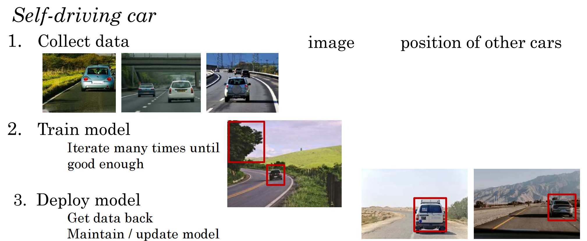
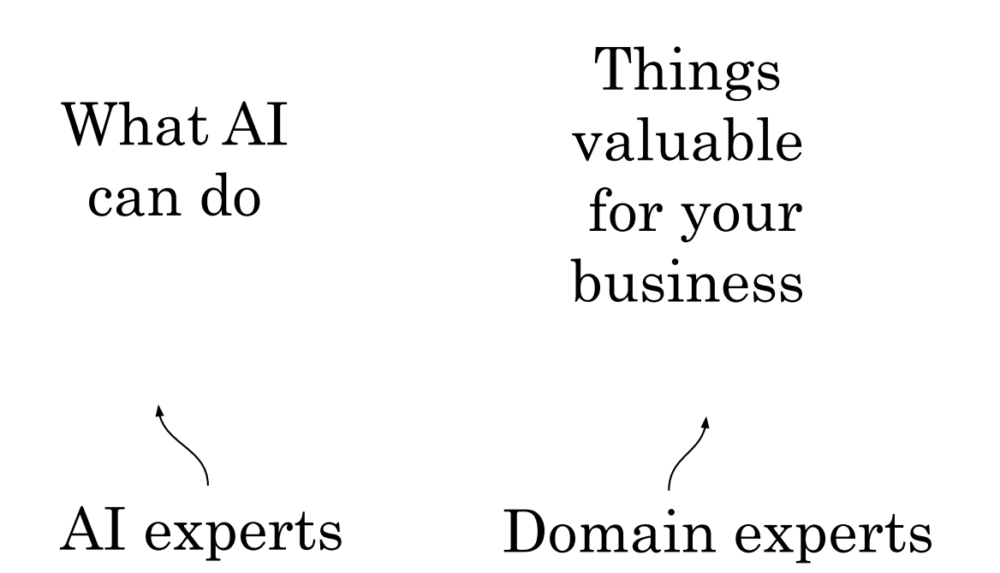

# 构建 AI 项目

## 机器学习项目的工作流程

### 机器学习项目的关键步骤

1. 收集数据
2. 训练模型
   - 迭代多次直到效果足够
3. 部署模型
   - 获取数据
   - 维护/更新模型

实践：

自动驾驶汽车

1. 收集数据 ———— 图像，其他车辆的位置信息
2. 训练模型
   - 迭代多次直到效果足够
3. 部署模型
   - 获取数据 ———— 获取新的车型信息
   - 维护/更新模型

## 数据科学项目的工作流程

### 数据科学项目的关键步骤

1. 收集数据
2. 分析数据
   - 迭代多次获取更好的洞察力
3. 提出假设/行动
   - 部署变更
   - 周期性重新分析新数据

Data Science VS Machine Learning

| 特性           | Data Science                    | Machine Learning     |
| -------------- | ------------------------------- | -------------------- |
| 销售           | 优化销售渠道                    | 自动名单排序         |
| 生产线管理经理 | 优化生产线                      | 自动视觉检测（缺陷） |
| 招聘           | 优化招聘渠道                    | 自动筛选简历         |
| 市场           | A/B test（ 收集不同版本的数据） | 定制产品推荐         |
| 农业           | 产量分析                        | 精准除草             |

数据科学：数据收集、数据清洗、数据分析、数据可视化、机器学习、决策支持

机器学习：监督学习、非监督学习、强化学习、半监督学习、自监督学习

数据科学是更广泛的概念，会使用一些机器学习的方法来解决复杂的数据问题

## 如何选择一个人工智能项目

### AI知识和领域知识

头脑风暴框架

- 任务自动化比取代工作岗位更重要？
  - 在工作流程中找到一个或多个步骤能够使用机器学习进行自动化的任务
- 驱动商业价值的主要因素有哪些？
- 公司业务中的主要痛点有哪些？
- 即使**没有大量数据也可以取得进展**
    * 拥有更多的数据几乎没有坏处。
    * 数据让一些业务(比如网络搜索)站得住脚。
    * 但是对于小数据集，你仍然可以取得进展。

### 项目尽职调查

技术调查

- AI 系统能达到技术要求（语音识别率 95%等）
- 所需要的数据量
- 工程化规划时间

商业调查

- 降低成本
- 增加收入
- 发起新产品和商业

道德考察

- 什么事情能做，什么事情不能做
- 做对社会有益的事情，而不是重点在 make money

### Build Or Buy

- ML项目通常可以内部开发或者外包
- DS项目更多是内部开发
- 有商业标准的东西(行业解决方案)，更好的是购买而不是自己搭建

## 与人工智能团队合作

- 明确验收的标准

AI Team

训练集 测试集
learn (开发集和验证集)
A -> B

期望 100%准确率不可能

- ML 的限制
- 数据不足
- 错误数据
- 标签不明或错误

# 人工智能团队的技术工具

- ML 框架
  - TensorFlow, PyTorch, Keras, Caffe
- 研究发布
  - Arxiv
- 开源制品
  - GitHub

* CPU 中央处理单元
* GPU 图像处理单元
* Cloud / On-premises **云部署和本地化部署**
* **Edge 边缘部署**(处理数据放置到收集数据的地方，快速处理数据并做出决策，智能驾驶)
    * 边缘计算：加快系统的反应时间
