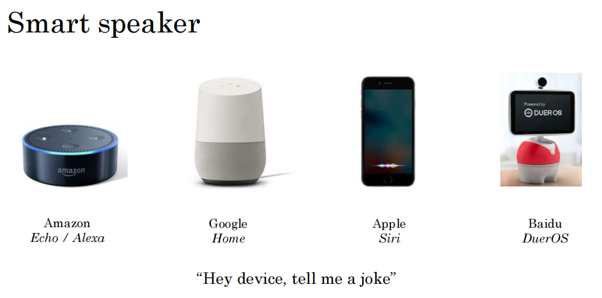
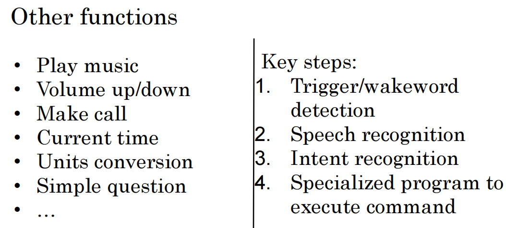
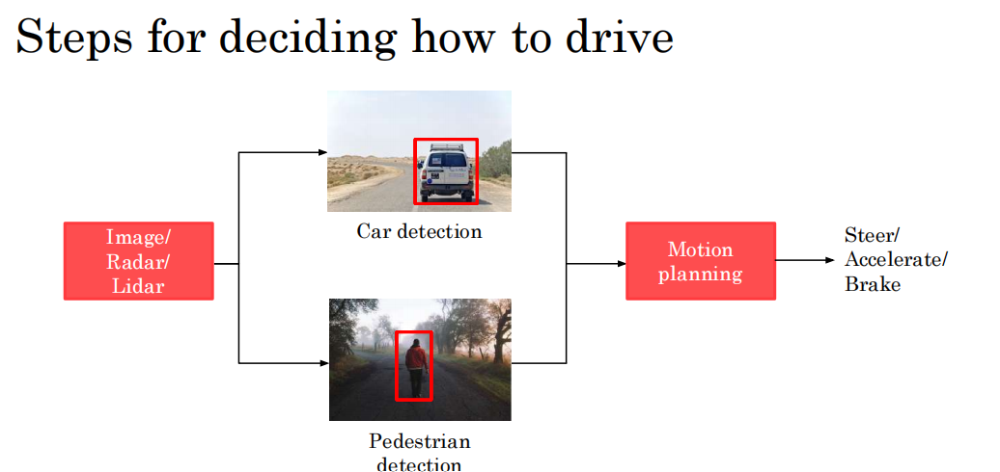
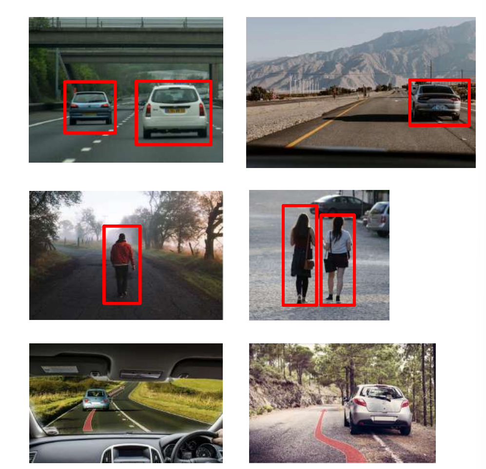
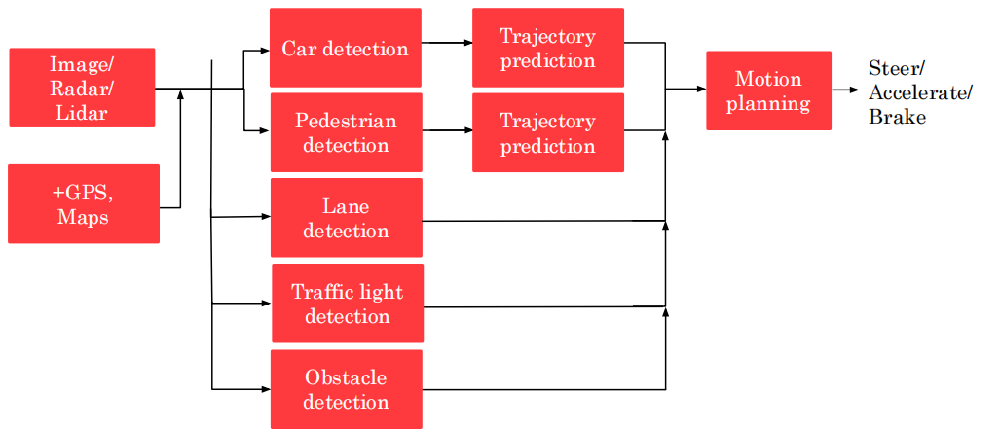
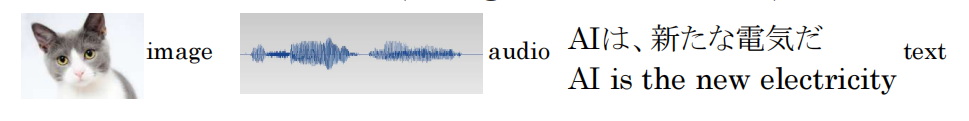
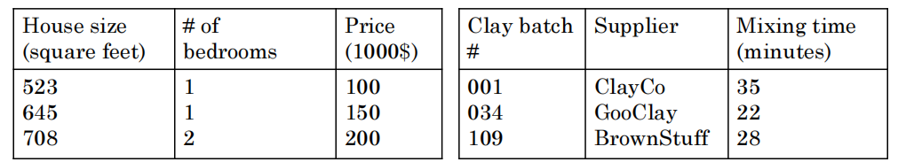

# Building AI in Your Company

# Case studies of complex AI products

## 智能扬声器

输入：“hello，小爱同学, 播放周杰伦的稻香”

执行步骤（AI pipeline）：

- 触发提示词检测
  * Audio（小爱智能助手） ——> hello，小爱同学
- 语音识别 
  * Audio（小爱智能助手）——> 播放周杰伦稻香
- 意图识别 
  * 重点关注 播放音乐 ——> 音乐播放器
- 执行任务 
  * 播放稻香

其他功能：

## 自动驾驶汽车

步骤：

1. 车辆检测、
    * 轨迹预测：图像、雷达、激光雷达、GPS、陀螺仪、地图信息
2. 行人检测、轨迹预测
    * 交通标识、路标检测
    * 交通信号灯检测
    * 障碍物检测
3. 运动规划 
    * 速度，加速度、转向、刹车等

预测图示：

自动驾驶每分钟处理几GB到十几G的数据信息

# Example roles of an AI team

## 人工智能团队的示例角色

- 软件工程师
  - 例如，实现音乐播放、自动驾驶的可靠性
- 机器学习工程师
  - 编写软件，用于生成 A ——> B 的映射
- 机器学习研究员
  - 负责开发机器学习的前沿技术
- 应用机器学习科学家
- 数据科学家
  - 监测数据和分析其背后的意义
  - 展示由数据分析得到的见解帮助驱动商业决策
- 数据工程师
  - 组织数据
  - 确保数据易于读取和保存，而且保证以一种很安全、经济高效的方式
- AI 产品经理
  - 帮助判断什么是可行且有价值的

## Getting started with a small team

- 1 Software Engineer , or
- 1 Machine Learning Engineer/Data Scientist, or
- Nobody but yourself

## 人工智能转型计划

AI 转型手册步骤：

1. 执行试点项目去获得势头或优势
   - **初创项目的成功比商业价值更重要**，能够逐步让其他团队转向 AI
   - 需那种 6-12 个月能展示成效的项目
   - 内外部项目都可以
2. 构建内部 AI 团队
   - **AI 团队给其他部门赋能**
3. 提供广泛的 AI 培训
   - 高管 
      * 知道 AI 可以给企业带来什么；
      * AI 策略；
      * 资源分配（GPU 卡，计算资源等）
   - AI 项目领导 
      * 制定项目方向（技术和商业调查）；
      * 部门内资源分配
      * 监督 AI 项目的进程
   - AI 工程师 
      * 构建 AI 软件；
      * 收集数据；
      * 执行特定 AI 任务
4. 制定 AI 策略
   - **利用 AI 去创建一个特定于你所在行业的优势**
   - 设计一种与 AI 的良性循环一致的公司策略
   - 考虑创建数据策略
     - 战略数据获取 ———— 免费服务（阿里云、chatGPT,AI 问答等）
     - 构建统一的数据仓库 ———— 将数据库统一，便于分析生产过程中的问题
   - 创建网络效果和平台优势
     - 赢家通吃（滴滴，将驾驶员和乘客联系在一起的平台）
5. 开展内外部交流
   - 投资者的关系
   - 政府的关系
   - 消费者/用户 培训
   - AI 人才招聘
   - 内部沟通

## 要避免的人工智能陷阱

- 不要指望 AI 解决所有事情
  * 认识到 AI 可以做和不可以做的事情，考虑技术、数据和工程资源的限制
- 指望依赖少数机器学习工程师为公司提供使用用例 
  * 让工程师与业务人才交流，并让他们跨职能地工作，以寻找可行和有价值的项目
- **不要指望 AI 项目一次就能成功** 
  * AI 开发通常是一个**迭代过程**，需要经过多次才能取得成功
- 不要指望传统的计划流程在没有变化的情况下应用
  * 与 AI 团队合作，以建立有意义的时间估计，里程碑，KPI 或指标等。
- 不要以为需要超级厉害的 AI 工程师才能开启一个项目 
 * 继续构建团队，与团队合作

## Taking your first step in AI

* Get friends to learn about AI
  - This course
  - Reading group
* Start brainstorming projects
  - No project is too small
* Hire a few ML/DS people to help
* Hire or appoint an AI leader (VP AI, CAIO, etc.)
* Discuss with CEO/Board possibilities of AI Transformation
  - Will your company be much more valuable and/or more effective 
 if it were good at AI?

# 主要人工智能应用领域调查

## 计算机视觉

- 图像分类/对象识别
  - 面部识别
- 对象检测
- 图像分割
- 寻迹/跟踪

## 自然语言处理

- 文本分类
  - 情绪识别
- 信息检索
  - web搜索
- 名称实体识别 
  - 提取人名，地名等
- 机器翻译
  - 中英文翻译
- 解析和语音部分标注
  - 句子中的名词、介词、限定词等

## 语音

- 语音识别 
  - 语音 to 文本
- 提示词检测
- 演讲者ID
- 语音合成
  - 文本到语音，TTS

## 机器人领域

自动驾驶为例

- 预测 
  - 周围环境检测
- 运动规划 
  - 找寻路径
- 控制 
  - 发送指令按照规定路径运行

## 通用的机器学习

- 非结构化数据 

- 结构化数据

# 主要人工智能技术调查

**非监督学习**

- 聚类算法
  - 输入无标签的数据，输出有趣的结论
  - 语料学习

**监督式学习**
  
* （学习从输入 A 到输出 B 的映射），现阶段最有价值的技术
* 例如，杯子图片（好和坏），构建 AI 应用完成 95%良品率的杯子检测

**强化学习**

使用奖励信号去告知 AI 做得好还是坏，AI 会自动学习以获取最大化奖励

缺点 ：需要大量的数据

**迁移学习 ———— 举一反三**

- 学习任务 A，根据先前的知识帮助任务 B 
  * 训练了一个车辆检测模型，对于新的高尔夫车型，有相同的车轮、运行轨迹的检测方法同样适用

**生成对抗网络**

**知识图谱**