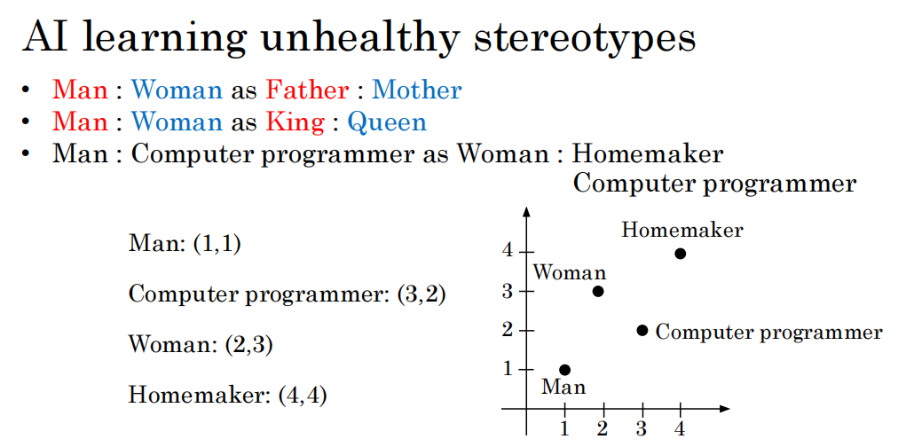
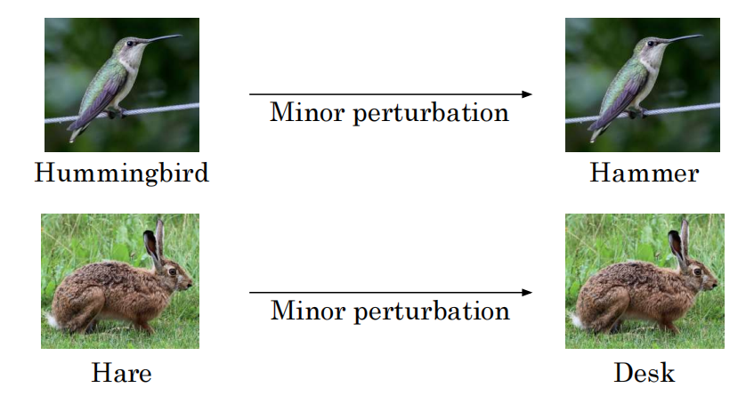
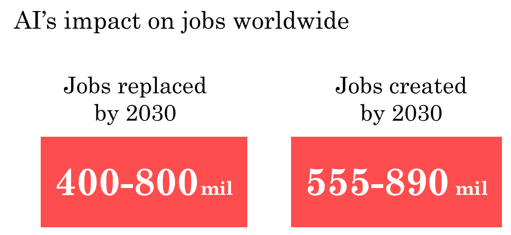
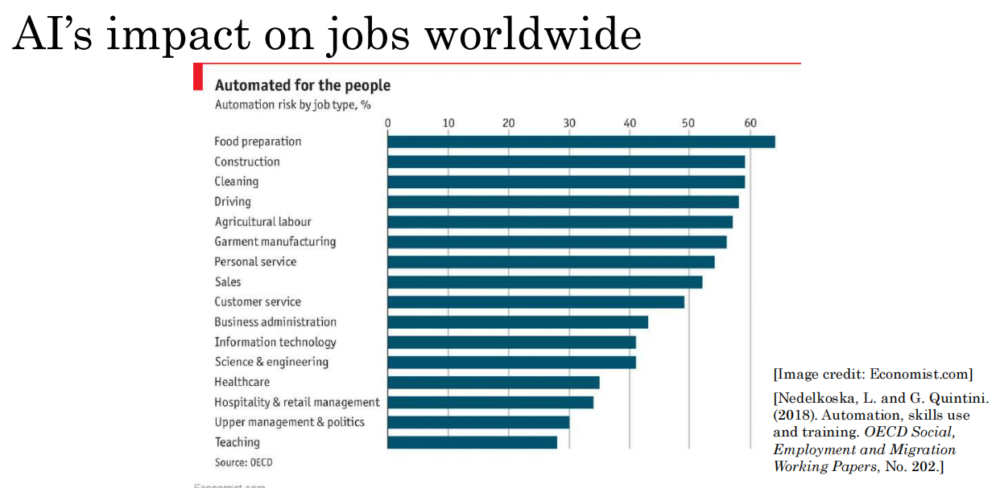

# AI and Society

## 对人工智能的现实观点

AI 黄金准则：

- 太乐观
- 太悲观
- 正好： AI 不能做所有事情，但是它正在改变行业

AI 限制：

- 性能限制
- 难以解释（不擅长解释） 需要解释为什么这个模型效果这么好？ 可解释性
- 偏见 AI 通过偏见的数据
- AI 的对抗性攻击

## 歧视/偏见

### 歧视/偏见带来的影响

- 歧视女性的招聘工具
- 面部识别匹配深色皮肤
  - 个人犯罪照片
- 银行贷款审批
- 强化不健康刻板印象的毒性作用

### 对抗歧视

- 技术解决方案
  - 将数字中带有偏见的参数设置为 0
  - 尽量使用存在较少偏见和或更具包容性的数据
- 系统有良好透明度和审计流
- 多样化的劳动力
  - 构建人工智能系统时，拥有更多独特的视角

## 针对人工智能的对抗攻击

AI 看待图片的方式与人类不同，通过修改图像的像素，人类可能认为还是同一个种类，但是对于 AI 而已是不同种类

对抗性防御
- 防御确实存在，但会产生一些成本
- 类似于垃圾邮件与反垃圾邮件，我们可能处于某些应用的军备竞赛

## 人工智能的不利用途

不利的用途

- DeepFakes
  - 深度学习视频篡改技术
- 破坏民主和隐私
  - 对个人的压迫性监测
- 生产虚假评论
- 垃圾邮件和反垃圾邮件 欺诈和反欺诈

## 人工智能与发展中经济体

- 移动电话
- 移动支付
- 在线教育

- 美国和中国处于领先地位，但所有人工智能社区仍然不成熟
- 专注于人工智能，以加强一个国家的垂直行业
- 加快公私伙伴关系的发展

## 人工智能与就业

自动化可以实现的事情更多，AI 加速自动化进程

如何估计多少工作可以被取代？

思考哪些任务构成了这个工作，然后对每项任务估计通过 AI 实现自动化的程度

——— 工作包含高度自动化的任务，就更容易被取代

解决方案:

- 有条件的基本收入：提供安全网但鼓励学习
- 终身学习
- 政治解决方案
