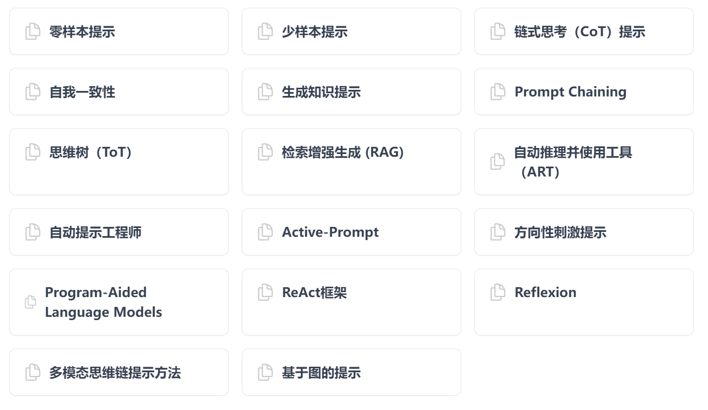

# Prompt Engineering Guide

# Reference information

* [Prompt Engineering Guide](https://www.promptingguide.ai/zh)

## concept

Prompt Engineering is a newer discipline. Pay attention to the development and optimization of ** prompts to help users use Large Language Model (LLM) for various scenarios and research areas.Mastering the prompt project -related skills will help users better understand the ability and limitations of large language models.

*Researchers can use prompt projects to improve the ability of large language models ** to handle complex task scenarios **, such as Q & A and arithmetic reasoning capabilities.

*Developers can achieve efficient integration with large language models or other ecological tools by reminding engineering design and research and development of strong engineering technology.

* Users can improve the security of large language models by prompting projects, and they can also empower large language models, such as using professional field knowledge and external tools to enhance the ability of large language models.

Prompting project is not just about design and research and development prompts.It contains various skills and techniques that interact with large language models and research and development.** Prompt that the project plays an important role in realizing, docking with large language models, and understanding of large language models. **.

## prompt project profile


* Model settings
* Temperature: The smaller the parameter values ​​of the testure, the more the model will return a certain result.
* TOP_P: Using Top_P (technique called Nucleus Sampling with Temperature), it can be used to control the certainty of the model returning results.If you need accurate and factual answers, the parameter value is lowered.If you are looking for more diverse responses, you can adjust its value.

* Tips
* Contains the following elements:
*** instruction **: Specific tasks or instructions to be executed by the model.
*** Context **: Contains external information or extra context information to guide the language model to respond better.
*** Enter data **: The content or problem of the user input.
*** Output indication **: specify the type or format of the output.

* The general skills of the design prompt
* Starting simplicity: When you have a big task involving many different sub -tasks, you can try to decompose the task into a simpler sub -task and gradually build with the improvement.
* Directive: Use the command to indicate the model to perform various simple tasks, such as "writing", "classification", "summary", "translation", "sorting", etc., so as to design effective prompts for various simple task design.
* Example
```
hint:
### instruction ###
Translate the following text into Spanish:
Text: "Hello!"

Output:
BleakHola!
```

* Specificity
*** In fact, the provision in the prompt is very effective for expected outputs to obtain a specific format.**


* Avoid unclear
* What or do you do?
* Another common technique when designing prompts is to avoid saying not to do anything, but what to do to do

* Example of prompt words
* Text summary
* Information extraction
* Questions and Answers
* Text classification
* Dialogue
* Code generation
*Reasoning: One of the most difficult tasks is to require some form of reasoning tasks **

## prompt technology



## prompt application


Based on a strong interest in large language models, we have compiled this new prompt project guide, introducing the papers, learning guidelines, models, lectures, reference materials, large language model capabilities, and other and prompt projects related to large language models, as well as other and with prompt projectsRelated tools.

1. Prompt engineering basics
Concept and background: Prompt that engineering refers to optimizing the response quality of the AI ​​system by accurate design and adjustment dialogue prompts.The website explains the background of this field, how to improve the accuracy and correlation of the model through targeted prompts.
Working principle: Introduce how the AI ​​model is generated by input prompts to generate answers.Including how to convert the prompt into a form that the model can understand, and how the model uses its training data to generate a response.

2. Prompt design principles
Clearance and specificity: Clear prompts can reduce ambiguity and improve the accuracy of AI response.Examples include: Avoid using vague languages ​​to ensure that the prompt contains all necessary information.
Context provided: effective prompts should contain sufficient background information, so that AI can understand the context of requests.For example, provide scene description, historical background or other related data.
Format and structure: Use structured prompts to improve the quality of the output.The recommended format includes quiz pairs, task descriptions, template styles, etc. to help the model understand the form of answering expectations.

3. Case analysis
Successful prompt example: Show the successful prompt in practical application how to effectively guide the model to generate accurate and related answers.For example, provide specific problems, clear task goals and expected output formats.
Case prompt: Analyze the situation of the model generating unrelated or error output due to improper prompts, such as lack of necessary context or prompts that are too complicated.

4. Optimize strategy
Adjustment and iteration: Emphasizing the process of constantly adjusting the prompts based on actual feedback.Including how to identify and solve the problems in the prompts by analyzing the results generated by the model.
Experiment and verification: It is recommended that users test their effects through different prompts and adjust them according to the performance of the model.Including A/B testing, the use of user feedback, etc.

5. Practical guide
Best practice: provides the best practice in practical applications, such as how to use prompt project principles in specific tasks (such as content generation, customer service dialogue, knowledge and answer, etc.).
Common problems solve: cover some common challenges and solutions that may encounter during the prompt project, such as how to deal with the prejudice of the model, how to ensure the accuracy and correlation of the content of the content.
The website provides a comprehensive prompt engineering guide to help users interact with the AI ​​system effectively and improve its application effect and output quality.
