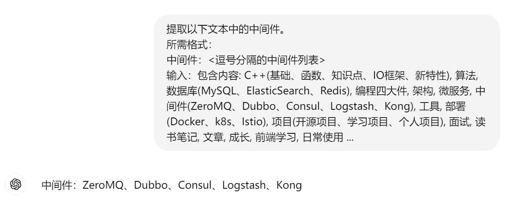

# 提示工程指南

# 参考资料

* [Prompt Engineering Guide](https://www.promptingguide.ai/zh)

## 概念

提示工程（Prompt Engineering）是一门较新的学科，关注**提示词开发和优化，帮助用户将大语言模型（Large Language Model, LLM）用于各场景和研究领域**。 掌握了提示工程相关技能将有助于用户更好地了解大型语言模型的能力和局限性。

* 研究人员可利用提示工程来提升大语言模型**处理复杂任务场景的能力**，如问答和算术推理能力。

* 开发人员可通过提示工程设计、研发强大的工程技术，实现和大语言模型或其他生态工具的**高效接轨**。

* 用户可以通过提示工程来提高大语言模型的安全性，也可以赋能大语言模型，比如借助专业领域知识和外部工具来增强大语言模型能力。

提示工程不仅仅是关于设计和研发提示词。它包含了与大语言模型交互和研发的各种技能和技术。**提示工程在实现和大语言模型交互、对接，以及理解大语言模型能力方面都起着重要作用**。

## 提示工程简介


* 模型设置
    * Temperature: temperature 的参数值越小，模型就会返回越确定的一个结果。
    * Top_p: 使用 top_p（与 temperature 一起称为核采样（nucleus sampling）的技术），可以用来控制模型返回结果的确定性。如果你需要准确和事实的答案，就把参数值调低。如果你在寻找更多样化的响应，可以将其值调高点。

* 提示词
    * 包含以下任意要素：
        * **指令**：想要模型执行的特定任务或指令。
        * **上下文**：包含外部信息或额外的上下文信息，引导语言模型更好地响应。
        * **输入数据**：用户输入的内容或问题。
        * **输出指示**：指定输出的类型或格式。

* 设计提示的通用技巧
    * 从简单开始：当你有一个涉及许多不同子任务的大任务时，可以尝试将任务分解为更简单的子任务，并随着结果的改善逐步构建。
    * 指令：使用命令来指示模型执行各种简单任务，例如“写入”、“分类”、“总结”、“翻译”、“排序”等，从而为各种简单任务设计有效的提示。
        * example
        ```
        提示：
        ### 指令 ###
        将以下文本翻译成西班牙语：
        文本：“hello！”

        输出：
        ¡Hola!
        ```
    * 具体性
        * **事实上，在提示中提供示例对于获得特定格式的期望输出非常有效。**
        

    * 避免不明确
    * 做什么还是不做什么?
        * 设计提示时的另一个常见技巧是避免说不要做什么，而应该说要做什么

* 提示词示例
    * 文本概括
    * 信息提取
    * 问答
    * 文本分类
    * 对话
    * 代码生成
    * 推理：**最困难任务之一是需要某种形式的推理的任务**

## 提示技术


## 提示应用


基于对大语言模型的浓厚兴趣，我们编写了这份全新的提示工程指南，介绍了大语言模型相关的论文研究、学习指南、模型、讲座、参考资料、大语言模型能力以及与其他与提示工程相关的工具。

1. 提示工程基础
   概念和背景：提示工程指的是通过精确设计和调整对话提示来优化 AI 系统的响应质量。网站解释了这一领域的背景，如何通过有针对性的提示提高模型的准确性和相关性。
   工作原理：介绍了 AI 模型如何通过输入的提示来生成回答。包括如何将提示转化为模型能理解的形式，以及模型如何利用其训练数据来产生响应。

2. 提示设计原则
   明确性和具体性：清晰的提示能够减少歧义，提高 AI 的响应准确性。示例包括：避免使用模糊的语言，确保提示中包含所有必要的信息。
   上下文提供：有效的提示应该包含足够的背景信息，使得 AI 能够理解请求的上下文。例如，提供场景描述、历史背景或其他相关数据。
   格式和结构：使用结构化的提示可以提高输出的质量。推荐的格式包括问答对、任务描述、模板样式等，帮助模型理解期望的回答形式。

3. 案例分析
   成功的提示示例：展示了实际应用中成功的提示如何有效引导模型生成准确和相关的回答。例如，提供具体问题、明确的任务目标和预期输出格式。
   问题提示的案例：分析了那些因提示不当而导致模型生成无关或错误输出的情况，如缺乏必要的上下文或提示过于复杂。

4. 优化策略
   调整与迭代：强调了根据实际反馈不断调整提示的过程。包括如何通过分析模型生成的结果来识别和解决提示中的问题。
   实验和验证：建议用户通过不同的提示实验来测试其效果，并根据模型的表现进行调整。包括 A/B 测试、用户反馈的利用等方法。

5. 实践指南
   最佳实践：提供了实际应用中的最佳实践，如如何在特定任务（如内容生成、客服对话、知识问答等）中应用提示工程原理。
   常见问题解决：涵盖了在提示工程过程中可能遇到的一些常见挑战及其解决方案，如如何处理模型的偏见、如何确保生成内容的准确性和相关性。
   该网站提供了全面的提示工程指南，旨在帮助用户有效地与 AI 系统互动，提升其应用效果和输出质量。
