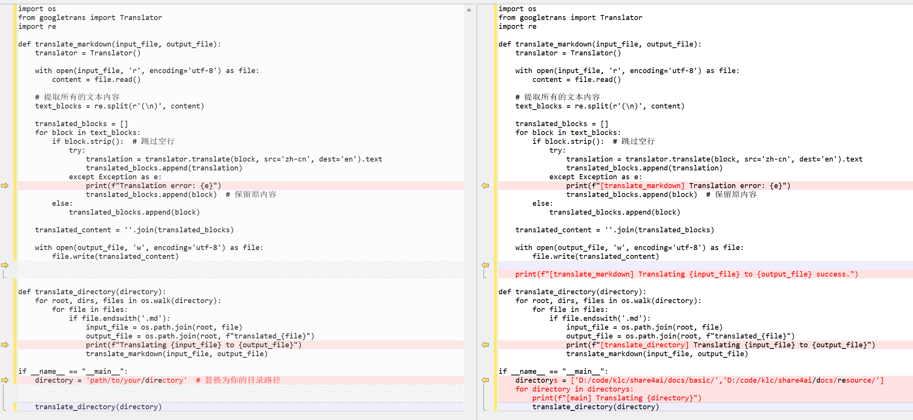

# 如何使用通义千问，做一个工具实现所有目录下的中文.md翻译成英文.md

## 过程

提示词1：`vscode插件将中文markdown的内容直接转换成英文`

结果见：translate_md_output1.md

提示词2：`遍历指定目录下所有的.md文件，将其翻译成英文的md`

结果见：translate_md_output2.md

## 修改



## 安装依赖

```sh
PS D:\code\klc\share4ai> pip install googletrans==4.0.0-rc1
```

## 实际运行

```sh
PS D:\code\klc\share4ai\tools> python .\translate_md.py
[main] Translating D:/code/klc/share4ai/docs/basic/
[translate_directory] Translating D:/code/klc/share4ai/docs/basic/README.md to D:/code/klc/share4ai/docs/basic/translated_README.md
[translate_markdown] Translating D:/code/klc/share4ai/docs/basic/README.md to D:/code/klc/share4ai/docs/basic/translated_README.md success.
[translate_directory] Translating D:/code/klc/share4ai/docs/basic/ai\concept.md to D:/code/klc/share4ai/docs/basic/ai\translated_concept.md
[translate_markdown] Translating D:/code/klc/share4ai/docs/basic/ai\concept.md to D:/code/klc/share4ai/docs/basic/ai\translated_concept.md success.
[translate_directory] Translating D:/code/klc/share4ai/docs/basic/ai\translated_concept.md to D:/code/klc/share4ai/docs/basic/ai\translated_translated_concept.md
[translate_markdown] Translating D:/code/klc/share4ai/docs/basic/ai\translated_concept.md to D:/code/klc/share4ai/docs/basic/ai\translated_translated_concept.md success.
[translate_directory] Translating D:/code/klc/share4ai/docs/basic/ann\concept.md to D:/code/klc/share4ai/docs/basic/ann\translated_concept.md
[translate_markdown] Translating D:/code/klc/share4ai/docs/basic/ann\concept.md to D:/code/klc/share4ai/docs/basic/ann\translated_concept.md success.
[translate_directory] Translating D:/code/klc/share4ai/docs/basic/cv\concept.md to D:/code/klc/share4ai/docs/basic/cv\translated_concept.md
[translate_markdown] Translating D:/code/klc/share4ai/docs/basic/cv\concept.md to D:/code/klc/share4ai/docs/basic/cv\translated_concept.md success.
[translate_directory] Translating D:/code/klc/share4ai/docs/basic/dp\concept.md to D:/code/klc/share4ai/docs/basic/dp\translated_concept.md
[translate_markdown] Translating D:/code/klc/share4ai/docs/basic/dp\concept.md to D:/code/klc/share4ai/docs/basic/dp\translated_concept.md success.
[translate_directory] Translating D:/code/klc/share4ai/docs/basic/ml\concept.md to D:/code/klc/share4ai/docs/basic/ml\translated_concept.md
[translate_markdown] Translating D:/code/klc/share4ai/docs/basic/ml\concept.md to D:/code/klc/share4ai/docs/basic/ml\translated_concept.md success.
[translate_directory] Translating D:/code/klc/share4ai/docs/basic/nlp\concept.md to D:/code/klc/share4ai/docs/basic/nlp\translated_concept.md
[translate_markdown] Translating D:/code/klc/share4ai/docs/basic/nlp\concept.md to D:/code/klc/share4ai/docs/basic/nlp\translated_concept.md success.
[translate_directory] Translating D:/code/klc/share4ai/docs/basic/rp\concept.md to D:/code/klc/share4ai/docs/basic/rp\translated_concept.md
[translate_markdown] Translating D:/code/klc/share4ai/docs/basic/rp\concept.md to D:/code/klc/share4ai/docs/basic/rp\translated_concept.md success.
[main] Translating D:/code/klc/share4ai/docs/resource/
[translate_directory] Translating D:/code/klc/share4ai/docs/resource/README.md to D:/code/klc/share4ai/docs/resource/translated_README.md
[translate_markdown] Translating D:/code/klc/share4ai/docs/resource/README.md to D:/code/klc/share4ai/docs/resource/translated_README.md success.
[translate_directory] Translating D:/code/klc/share4ai/docs/resource/article\train_own_models.md to D:/code/klc/share4ai/docs/resource/article\translated_train_own_models.md
[translate_markdown] Translating D:/code/klc/share4ai/docs/resource/article\train_own_models.md to D:/code/klc/share4ai/docs/resource/article\translated_train_own_models.md success.
[translate_directory] Translating D:/code/klc/share4ai/docs/resource/book\recommend_list.md to D:/code/klc/share4ai/docs/resource/book\translated_recommend_list.md
[translate_markdown] Translating D:/code/klc/share4ai/docs/resource/book\recommend_list.md to D:/code/klc/share4ai/docs/resource/book\translated_recommend_list.md success.
[translate_directory] Translating D:/code/klc/share4ai/docs/resource/course\ai-for-everyone.md to D:/code/klc/share4ai/docs/resource/course\translated_ai-for-everyone.md
[translate_markdown] Translating D:/code/klc/share4ai/docs/resource/course\ai-for-everyone.md to D:/code/klc/share4ai/docs/resource/course\translated_ai-for-everyone.md success.
[translate_directory] Translating D:/code/klc/share4ai/docs/resource/course\ai-for-everyone\01_what-is-ai.md to D:/code/klc/share4ai/docs/resource/course\ai-for-everyone\translated_01_what-is-ai.md
[translate_markdown] Translating D:/code/klc/share4ai/docs/resource/course\ai-for-everyone\01_what-is-ai.md to D:/code/klc/share4ai/docs/resource/course\ai-for-everyone\translated_01_what-is-ai.md success.
[translate_directory] Translating D:/code/klc/share4ai/docs/resource/course\ai-for-everyone\02_building-ai-projects.md to D:/code/klc/share4ai/docs/resource/course\ai-for-everyone\translated_02_building-ai-projects.md
[translate_markdown] Translating D:/code/klc/share4ai/docs/resource/course\ai-for-everyone\02_building-ai-projects.md to D:/code/klc/share4ai/docs/resource/course\ai-for-everyone\translated_02_building-ai-projects.md success.
[translate_directory] Translating D:/code/klc/share4ai/docs/resource/course\ai-for-everyone\03_building-ai-in-your-company.md to D:/code/klc/share4ai/docs/resource/course\ai-for-everyone\translated_03_building-ai-in-your-company.md
[translate_markdown] Translating D:/code/klc/share4ai/docs/resource/course\ai-for-everyone\03_building-ai-in-your-company.md to D:/code/klc/share4ai/docs/resource/course\ai-for-everyone\translated_03_building-ai-in-your-company.md success.
[translate_directory] Translating D:/code/klc/share4ai/docs/resource/course\ai-for-everyone\04_ai-and-society.md to D:/code/klc/share4ai/docs/resource/course\ai-for-everyone\translated_04_ai-and-society.md
[translate_markdown] Translating D:/code/klc/share4ai/docs/resource/course\ai-for-everyone\04_ai-and-society.md to D:/code/klc/share4ai/docs/resource/course\ai-for-everyone\translated_04_ai-and-society.md success.
[translate_directory] Translating D:/code/klc/share4ai/docs/resource/openprj\github_prj.md to D:/code/klc/share4ai/docs/resource/openprj\translated_github_prj.md
[translate_markdown] Translating D:/code/klc/share4ai/docs/resource/openprj\github_prj.md to D:/code/klc/share4ai/docs/resource/openprj\translated_github_prj.md success.
[translate_directory] Translating D:/code/klc/share4ai/docs/resource/website\prompt-engineering-guide.md to D:/code/klc/share4ai/docs/resource/website\translated_prompt-engineering-guide.md
[translate_markdown] Translating D:/code/klc/share4ai/docs/resource/website\prompt-engineering-guide.md to D:/code/klc/share4ai/docs/resource/website\translated_prompt-engineering-guide.md success.
PS D:\code\klc\share4ai\tools> 
```